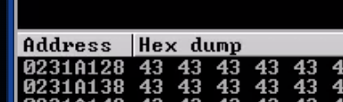

# BOF Windows
> OSCP sınavı BOF adımları

### Overview
uygulamayı analiz etmek için 3 method vardır.
* Kaynak kod analizi
* Reverse engineering
* Fuzzing

### Fuzzing

SLMail uygulaması için ornek fuzzing kodu

test
